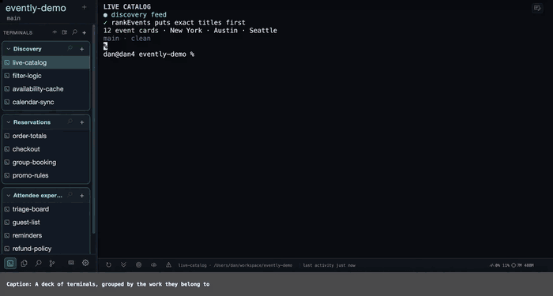
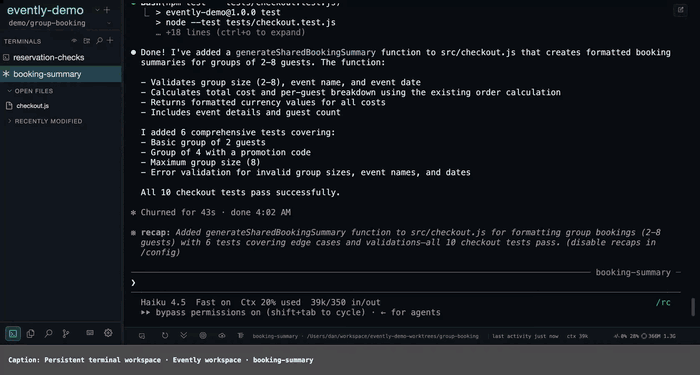

<div align="center">

# TermDeck

**A persistent workspace for coding agents.**

</div>

Puppeteer all your agents from one lightweight browser tab. Never lose a session or a half-written prompt
again — group them, give them worktrees, and let them talk to each other. Around them, a light IDE: an
editor, search, find-usages, Git, pull requests, syntax highlighting, linters, and notes on the fly. Remote
access built in: reach the whole deck from anywhere.

## Demos

Persistent agents, queues, notes, grouping, search, cross-agent handoff, and background activity.



*[Full-resolution terminal workflow video](docs/media/demo-terminals.webm)*

File tree, usages, history, blame, pending diffs, worktrees, remotes, and stashes.



*[Full-resolution Files/Git workflow video](docs/media/demo-files-git.webm)*

## Install

**macOS** — Homebrew brings `dtach`, `ripgrep`, and Python with it.

```sh
brew install danialfarid/tap/termdeck
termdeck service install
open http://127.0.0.1:8530
```

**Linux** — needs [`uv`](https://docs.astral.sh/uv/getting-started/installation/).

```sh
sudo apt install dtach ripgrep
uv tool install "git+https://github.com/danialfarid/termdeck.git"
termdeck service install
xdg-open http://127.0.0.1:8530
```

That takes the current release from the default branch; append `@<tag>` to pin an older one.

`termdeck service install` runs TermDeck in the background and starts it at login.

To update — sessions and settings stay in `~/.termdeck`, and live terminals keep running:

```sh
brew update && brew upgrade danialfarid/tap/termdeck                       # macOS
uv tool install --force "git+https://github.com/danialfarid/termdeck.git"  # Linux
termdeck service restart
```

## Start and stop

```sh
termdeck --open              # run in the foreground; Ctrl-C stops it
termdeck service start       # start the background service (installs it if it never was)
termdeck service stop        # stop it until the next start or login
termdeck service restart     # restart it; installs it too if it never was
termdeck service status      # is it running?
termdeck service logs        # tail the log
termdeck service uninstall   # stop it and remove the service
termdeck doctor              # report which external programs it found
```

Stopping TermDeck does not stop your terminals. They stay attached to `dtach` and are still there when it
comes back.

Press **+** to open a terminal, then choose an agent or shell and a project folder.

## Features

- **Any agent CLI** — Codex, Claude Code, AGY, Aider, OpenCode, and plain shells, side by side. Teaching it a
  new CLI is one adapter class.
- **Persistent sessions** — terminals and agent sessions survive browser and server restarts, and reopen into
  the same conversation after a machine restart.
- **Portable sessions** — export a terminal with its resume profile, draft, transcript, and available replay;
  import it as a dormant tab in another project or TermDeck installation.
- **Never lose a half-written prompt** — what you have typed is saved as you type. Refresh the page, restart
  the server, come back tomorrow: it is still in the box, and everything you have sent is in the history.
- **Parallel work** — group, reorder, fork, rename, close, reopen, and monitor many terminals. Background
  commands, monitors, and subagents show as live dots under the session that started them: nine agents, one deck,
  and a dot that tells you which one is actually waiting on you.
- **Agent handoff** — send selected context from a terminal, transcript, file, or note straight to another
  agent, without rebuilding the prompt.
- **[Agents talking to agents](docs/agents-termdeck-api.md)** — Codex hands Claude a task, watches its answer
  come back, and asks a follow-up, all through one local API. Every agent it starts is an ordinary terminal in
  your deck, so you can read the whole exchange as it happens.
- **Notifications** — attention and finished runs reach you while the tab is in the background, and a quiet
  release badge appears when a newer TermDeck version is available. Nothing updates automatically.
- **Transcript mode** — read clean conversations, queue follow-ups, run an agent's slash commands, inspect
  models, and open a conversation outline.
- **Search** — find sessions, prompts, responses, file names, and code across a project.
- **Files, Markdown, and media** — edit in Monaco, read Markdown as a rendered document, and open images, video,
  audio, and PDFs in place.
- **Git** — history, blame, diffs, staging, and GitHub pull requests, with a separate worktree when a task
  needs one of its own.
- **Code intelligence** — language servers for definitions, usages, diagnostics, hover, and code actions.
- **Notes, clipboard history, and attachments** — keep decisions and reusable context beside the agents, and
  drop a file or an image straight into a prompt.
- **Yours to rebind** — every keyboard shortcut, from the sidebar footer.
- **Issue-ready diagnostics** — one click downloads a bounded, sanitized support bundle; opt-in recording adds
  browser geometry and interaction timing without terminal output, prompts, source files, or credentials.
- **Phone and remote** — touch layouts, local Wi-Fi, Google-authenticated hosted access, or your own bearer-token
  tunnel with an optional monitoring-only mode.

```
┌──────────────────────────┬────────────────────────────────────────────────────┐
│ stock ▾                  │ terminal / transcript / file editor                │
├──────────────────────────┤                                                    │
│ TERMINALS          +  ⋯  │ $ codex resume 4f2a…                               │
│ ▾ ingestion         2 ●  │                                                    │
│   ◉ refactor parser      │   Analyzing the parser module…                     │
│   ○ review tests         │                                                    │
│ ● migrate cache          │   I found three call sites that need updating:     │
│                          │     trainer/prep/features/index_feat.py:210        │
│ RECENTLY CLOSED (50)     │     miner/sec/sec_miner.py:88                      │
│   ↺ old bugfix run       │                                                    │
│                          │ > continue                                         │
├──────────────────────────┼────────────────────────────────────────────────────┤
│ Files Search Git Notes   │ transcript  refresh  bottom  upload  model · stats │
└──────────────────────────┴────────────────────────────────────────────────────┘
```

## Requirements

- macOS 13+ or Linux
- Python 3.11+ (Homebrew installs it for you on macOS)
- `dtach` required; `ripgrep` recommended
- A current Chrome, Safari, Firefox, or Edge browser

## Troubleshooting

A terminal that looks wrong — garbled, blank, or behind — is almost always the browser's copy of it, not the
terminal. In order:

1. Reload the tab. If that is not enough, hard-refresh it (**⌘⇧R** / **Ctrl+Shift+R**).
2. Right-click the terminal in the side panel and choose **Restart**. The process is replaced; an agent
   terminal comes back into the same session.

If the page itself will not load, the loading screen offers **Refresh page**, **Restart TermDeck server**, and
**Stop running terminals** after a few seconds; from a shell, `termdeck service restart` does the same.

If the server will not start with *address already in use*, something else has port 8530: run it on another
with `termdeck --port 9000`, or bake that in with `termdeck --port 9000 service install`.

More in [docs/troubleshooting.md](docs/troubleshooting.md).

## Roadmap

- VS Code integration
- IntelliJ IDEA and JetBrains IDE integration
- Windows support

## Links

- [Full installation guide](docs/installation.md)
- [API reference](docs/api.md)
- [Configuration](docs/configuration.md)
- [Language servers](docs/language-servers.md)
- [Remote access](docs/remote-access.md)
- [Troubleshooting](docs/troubleshooting.md)
- [Architecture](docs/architecture.md)

## Features in detail

**Terminals and agents**

- Codex, Claude Code, AGY, Aider, OpenCode, or a plain shell, launched with the CLI's own permission mode
  (read-only, workspace-write, accept-edits, full access, …).
- Every terminal runs under `dtach`: closing the tab or restarting the server leaves the process running.
- Claude, Codex, and OpenCode sessions are tracked continuously — through `/clear` and in-TUI session switches —
  and resumed after a machine restart.
- Unsent input is reconstructed and saved as you type, and re-injected when the terminal comes back.
- Fork a session into one copy or up to 25 numbered ones, placed beside the original.
- Restart with a different permission mode, rename, copy the session ID, mark unread, ignore attention, or
  open a terminal alone in its own browser tab.
- Drag to reorder; collapsible, nameable groups; move one or many terminals between groups and projects.
- Search names and output across open and closed terminals, with match navigation inside a terminal.
- Recently closed terminals keep their history and group and reopen from the list.
- File paths and `path:line` references printed in any terminal are clickable.
- Drop a file or paste an image into a terminal and its path lands at the cursor.
- Per-agent icons in the terminal list, each toggleable; working state animates, unread stays until you look.
- Choose an explicit model at launch for Codex, Claude, AGY, Aider, or OpenCode. Aider and OpenCode accept
  OpenRouter model IDs while retaining their own terminal icon, activity signal, permissions, and resume rules.
- Live activity dots for background commands, monitors, and subagents under the session that owns them.
- The favicon shows the selected terminal's working and unread state.
- CPU and memory for the app and for each terminal's process tree in the bottom bar; under Maintenance, a
  process report, orphan cleanup, kill terminals older than 24 hours, and kill all.

**Transcript mode**

- The agent's own session file rendered as Markdown: code edits and thinking collapsible; model, reasoning
  effort, and elapsed time shown.
- A composer where Enter is a newline, Shift+Enter sends, ⌘Enter queues; queued prompts run in order, stay
  editable, and any one can be sent now.
- The agent's slash commands from a palette.
- Filters: hide prompts or thinking, show only code edits, fold near-duplicate responses.
- Conversation outline with timestamps for jumping between turns.
- Live context usage (`ctx 118k/258k`) and persisted prompt history.
- A submitted prompt stays visibly pending until the transcript confirms it — through reloads and restarts.

**Notifications**

- Desktop notifications when an agent needs attention or finishes a run longer than five seconds, unless you
  are looking at that terminal.
- Installed as a browser app, they carry TermDeck's name and icon.
- A Claude Code hook endpoint drives the attention badge from real permission prompts.

**Projects and worktrees**

- A project is a folder: add one from the **+** menu with a folder picker, or open a terminal in it and it
  registers itself. Switching projects swaps terminals, files, closed history, and defaults.
- Give a project or worktree a colour from its picker; the header label and the browser tab's favicon take
  it, so ten tabs tell apart at a glance.
- Every project, worktree, terminal, and file has a stable URL — one browser tab per project, or per task.
- Worktrees are discovered and created (named, on a chosen branch, in a remembered folder); view one or all;
  each keeps its own terminals, groups, and closed history.
- Delegated tasks can run in an isolated worktree with a review diff and keep, merge, or discard.

**Files and editor**

- VS Code's Monaco editor: highlighting, folding, find and replace, symbols, definitions and usages, Problems.
- Language servers add rename, code actions, hover documentation, and diagnostics.
- Markdown renders as a document with working links; images, video, audio, and PDFs open in place.
- Local snapshots and Git history for any open file, with diffs and targeted restore.
- Create, rename, duplicate, move, refresh, and trash from the tree — deletes go to the system trash.
- Open files and navigation history survive reloads; external changes are re-read.

**Git**

- Stage and unstage files or single hunks, commit, branches, stashes, and the commit graph.
- Diffs for pending changes and any commit, blame, compare any two versions, cherry-pick, and revert.
- Conflicts resolved ours, theirs, or by hand.
- Remotes: fetch, fast-forward pull, push over SSH or HTTPS, and clone straight into a project.
- GitHub pull requests listed in the panel; open on GitHub or copy the URL.

**Search**

- ripgrep across the project — plain or regex, case, whole word, include patterns, exclusion chips — with
  results that keep the tree, Git state, and modified time.
- Project-wide replace, capped at 200 files per run.
- Filename search: exact and contains first, typos second, with its own history and filters.
- Quick Open across commands, recent terminals, open files, file names, and symbols.

**Notes and clipboard**

- Multi-tab plain-text notes over the workspace, autosaved, edited in Monaco, filled from any selection;
  closed notes go to the trash.
- Copied-text history, with a picker that pastes into whatever is focused.
- Right-click any selection to copy it, note it, search from it, or hand it to an agent as **Ask an agent**.

**Automation**

- A local API to start a named agent with a model, permission mode, and placement; send it prompts; poll its
  last turn; write its output to a file; close it.
- Batch launch of up to 32 named tasks.
- Everything an agent starts is an ordinary terminal in the deck.

**Remote and mobile**

- Local Wi-Fi access on its own listener — no relay, no login.
- TermDeck Remote: Google sign-in through a hosted relay, with pairing controls.
- Optional bearer-token protection for direct LAN, VPN, SSH-tunnel, and reverse-proxy access; server-wide
  read-only mode keeps monitoring live while blocking terminal input and mutations.
- Touch layouts with long-press row actions, drafts kept through outages, and automatic reconnection.

**Look and feel**

- Themes: Nord, macOS Terminal, GitHub, One Dark, Monokai, Dracula, Solarized, Gruvbox, Tokyo Night,
  Catppuccin, Rosé Pine, Ayu, and high contrast.
- Font size per region — title, terminal list, terminal, editor, tree, tabs, diffs, icons, bottom bar — with an
  in-place slider over each.
- Every shortcut rebindable; panel widths remembered.
- Settings, notes, keybindings, and layout live in `~/.termdeck/settings.json` and can be exported.

**CLI and service**

- `termdeck` runs in the foreground; `termdeck service` installs, starts, stops, restarts, and tails a launchd
  or systemd user service.
- `termdeck doctor` names any missing program with its install command.
- Every flag is a `TERMDECK_*` variable, so a shell profile and a service unit are configured the same way.

## Security

TermDeck runs commands on your machine and binds to localhost by default. For direct network access, configure
`TERMDECK_ACCESS_TOKEN` and use an encrypted SSH/VPN/HTTPS path; read-only mode limits mutation but still exposes
files and session content.

## License

[Apache License 2.0](LICENSE)
